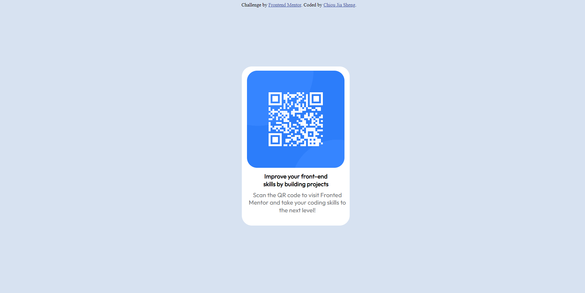

# Frontend Mentor - QR code component solution

This is a solution to the [QR code component challenge on Frontend Mentor](https://www.frontendmentor.io/challenges/qr-code-component-iux_sIO_H). Frontend Mentor challenges help you improve your coding skills by building realistic projects.

## Table of contents

- [Overview](#overview)
  - [Screenshot](#screenshot)
  - [Links](#links)
- [My process](#my-process)
  - [Built with](#built-with)
  - [What I learned](#what-i-learned)
  - [Continued development](#continued-development)
  - [Useful resources](#useful-resources)
- [Author](#author)
- [Acknowledgments](#acknowledgments)

## Overview

### Screenshot



### Links

- Solution URL: [Add solution URL here](https://your-solution-url.com)
- Live Site URL: [Add live site URL here](https://your-live-site-url.com)

## My process

Html

1. Create a qrcode card in the figma. Within the card, there would be **card-image**, **card-text** and **card-description**. And them copy the card to the html.
2. Add google font linkage in the head
3. Add stylesheet linkage in the head

CSS

1. `Body`: change background-color to #D7E2F1
2. `Card`: I want to place the card in the middle, I code with:

```{CSS}
top:0;
bottom: 0;
left: 0;
right: 0;

margin: auto;
```

3. `card-text`: change the font by **card-weight**,**font-family**, and **font-size**

### Built with

- Semantic HTML5 markup
- CSS custom properties
- Figma

### What I learned

By this project, I learn to design a card and place it in the right position by css. Also, I learn how to align the text and block element in the page.

### Continued development

With this card, I could fetch data from api, and display product from the shop.

### Useful resources

- [CSS Layout - Horizontal & Vertical Align](https://www.w3schools.com/css/css_align.asp) - This helped me for putting element in the right position.
- [Adobe Color](https://color.adobe.com/create/color-wheel) - This helpd me find the right color of the page.

## Author

- Website - [Chious](https://github.com/Chious)
- Frontend Mentor - [@Chious](https://www.frontendmentor.io/profile/Chious)
- Twitter - [@Chious](https://twitter.com/ChiouJiaSheng)

## Acknowledgments

Nope
